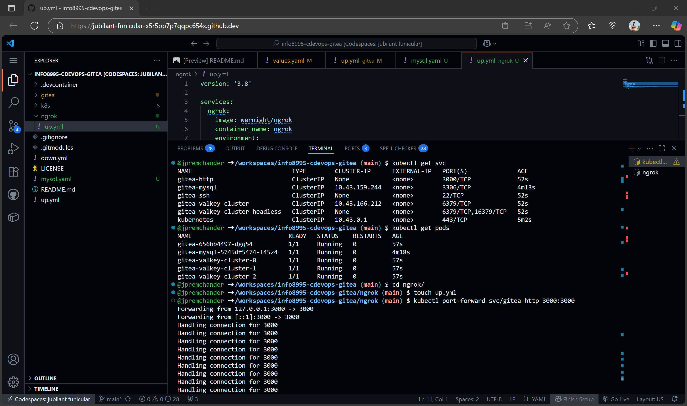
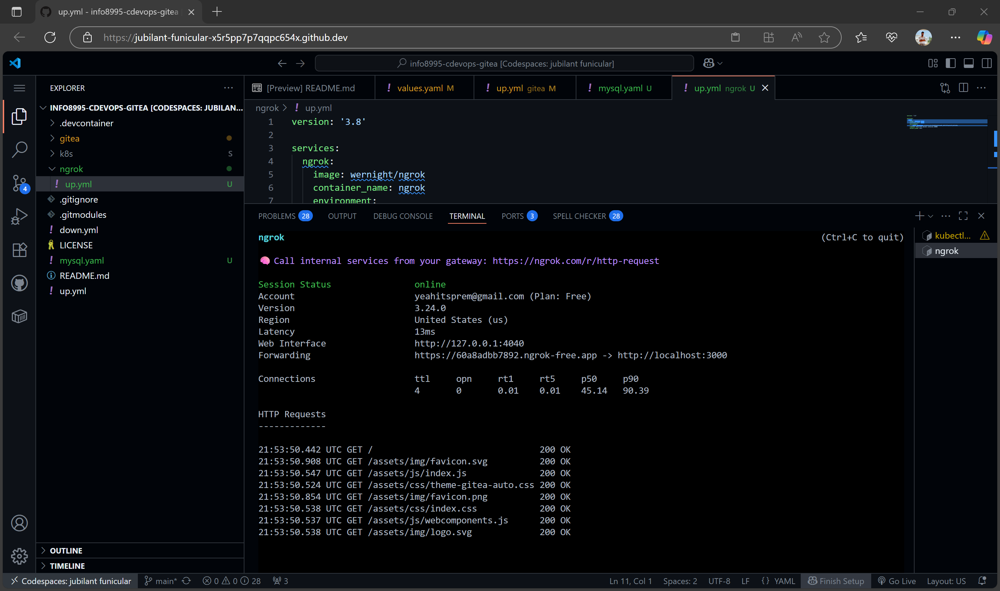
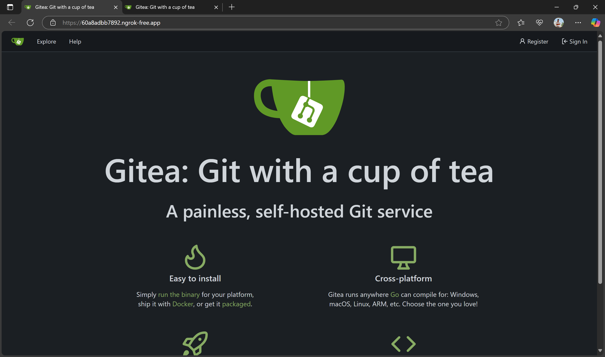
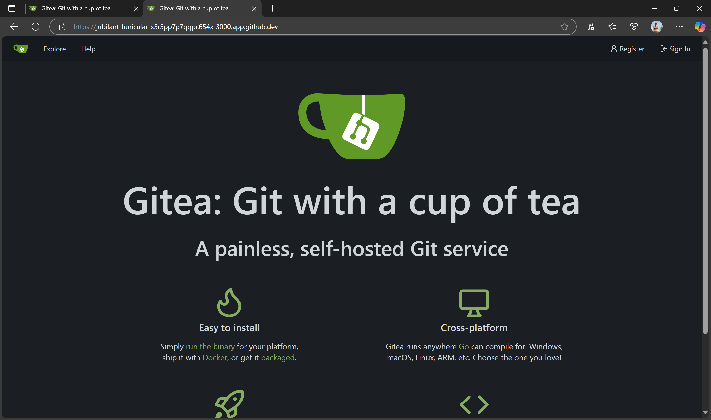

# CDEVOPS Gitea CI/CD Pipeline Assignment

## Overview

This project demonstrates a production-ready deployment of Gitea on Kubernetes using Helm, backed by a MySQL database for persistent storage. Deployment automation is done via Ansible, and the service is exposed publicly using ngrok.

---

## Project Structure

├── LICENSE
├── README.md
├── down.yml
├── gitea/
│ ├── up.yml
│ ├── down.yml
│ └── values.yaml
├── k8s/
│ └── mysql.yaml
├── mysql.yaml
├── up.yml
├── ngrok/
│ └── up.yaml
└── screenshots/
├── pods_and_services.png
├── ngrok_access.png
└── codespace_url.png

---

## Prerequisites

- Kubernetes cluster (`k3d` inside GitHub Codespace)
- `kubectl` CLI configured
- Ansible installed (`pip install ansible kubernetes`)
- ngrok account and auth token

---

## Deployment Steps

1. **Create Kubernetes cluster with k3d**
   ```bash
   k3d cluster create gitea-cluster
   export KUBECONFIG=$(k3d kubeconfig write gitea-cluster)

Deploy MySQL

# kubectl apply -f mysql.yaml

Deploy Gitea

# ansible-playbook gitea/up.yml

Check pod & service status

# kubectl get pods

# kubectl get svc

Port-forward Gitea

# kubectl port-forward svc/gitea-http 3000:3000

# Expose with ngrok

# ngrok http 3000

External Access

Ngrok URL:
https://60a8adbb7892.ngrok-free.app

GitHub Codespace URL:
https://jubilant-funicular-x5r5pp7p7qqpc654x-3000.app.github.dev/

Screenshots
✅ Pods and Services Running





🌐 Gitea Publicly Accessible via Ngrok



💻 Gitea Accessed via GitHub Codespace URL



Troubleshooting and Challenges
Kubernetes not running in Codespace
Encountered connection refused errors due to missing cluster.

k3s failed (systemd unavailable)
Switched to k3d to create a Docker-based lightweight Kubernetes cluster.

Ansible not found
Installed via pip install ansible kubernetes.

ngrok missing
Installed and authenticated manually for tunneling.

References
[Gitea Helm Chart](https://github.com/bitnami/charts)

[k3d Docs](https://k3d.io/v5.6.3/)

https://ngrok.com/

Author
Prem Chander Jebastian
9015480
Conestoga College – CDEVOPS Assignment 3